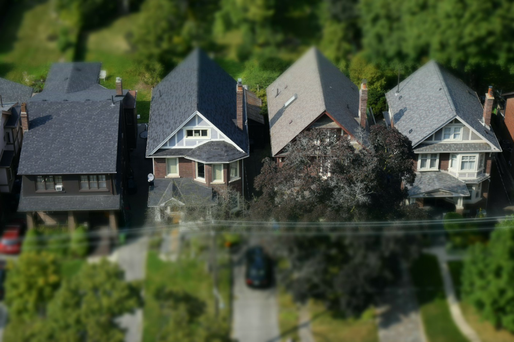

# Ames, Iowa Correlations in Housing Data

## Problem Statement
What can a homeowner or house flipper can do to maximize a house value prior to selling?
## Data Gathering
This project was based on datasets available on kaggle.com.
## Methods
The data is fairly complete but definitely had some issues. I found that 21 of the 80 columns contained null values. I intended to use up to seven variables in my model to show correlation, so I looked at the top ten or so variables to see if there were any issues that jumped out at me. There weren’t significant issues with the top ten or so variables except that many rows in “garage area” contained nulls. I deleted those as they amounted to approximately 5% of the data, which is not insignificant but in order to accurately create my models based on current information, I needed to be able to utilize this column. I also saw no way to be able to make any kind of educated guess to fill any of these nulls in, and time didn’t allow for that kind of research anyway. I also created a column that subtracted the year the house was built from the year the data was collected in order to get the house age. The seven variables I used were: overall quality, ground floor living area, garage area, garage cars, total basement square footage, first floor square footage, and house age.
## Modeling
For model 0, I set my features to be overall quality, ground floor living area, and garage area. I set my X and y variables, and then created X_train, y_train, X_test, and y_test for train_test_split. Next I instantiated my linear regression model, and fit it with my training data. I essentially repeated this process six times. For models 1 through 3, I scaled data first, and then used the top three, five, and seven variables in linear regression models. For models 4 through 6, I used scaled data and used the top three, five, and seven variables in Ridge and Lasso models. Being my first project, I didn’t realize I actually created two models each for models 4, 5, and 6, one Ridge and one Lasso. They all got roughly the same scores so it is a moot point, but it was an early lesson for me.
## Results
Model 0: train: .75 test: .77  
Model 1: train: .74 test: .8 
Model 2: train: .76 test: .82 
Model 3: train: .76 test: .82 
Model 4: train: .75 test: .78 
Model 5: train: .76 test: .82 
Model 6: train: .77 test: .83
## Conclusion
This was a big learning experience for me, being my first project.  All of my results had slight bias, meaning I could have added more variables for a better model. The results were  not terrible though.  I concluded that the best way to increase your home value on average is to improve the overall quality of the house (i.e. kitchen, house fixtures, etc), and open up the ground living area if possible. Having a garage and/or basement also correlated well to higher values, but those are either impossible or too expensive to install, so any increased value for the seller would be offset by the cost to build.
This was an interesting project for me as I went in thinking kitchens and bathrooms would be the biggest value gain for homeowners, but those were down the list. There wasn’t a category for kitchen or bathroom quality, which may have made a difference. Regardless, it was an important lesson that as a data scientist you have to go in open minded on every project, while at the same time you must use your knowledge of a field to identify things that may not make sense or could be errors, either on our part or the dataset. Overall, I liked this project and would love working in the real-estate industry to find more information like this.
## Data Dictionary
|Feature|Type|Dataset|Description|
|---|---|---|---|
|Id|int|train|house sale id|
|pid|int|train|parcel identification number  - can be used with city web site for parcel review|
|ms_subclass|int|train|identifies the type of dwelling involved in the sale|
|ms_zoning|object|float|train|identifies the general zoning classification of the sale|
|lot_frontage|int|train|area along street in linear feet|
|lot_area|object|train|lot area is square feet|
|street|object|train|type of road access to property|
|alley|object|train|type of alley access to property|
|lot_shape|object|train|general shape of the property|
|land_contour|object|train|flatness of the property|
|utilities|object|train|type of utilities available|
|lot_config|object|train|lot configuration|
|land_slope|object|train|slope of property|
|neighborhood|object|train|physical locations within Ames city limits|
|condition_1|object|train|proximity to various conditions|
|condition_2bldg_type|object|train|proximity to various conditions (if more than one is present)|
|house_style|object|train|style of dwelling|
|overall_qual|int|train|rates the overall material and finish of the house|
|overall_cond|int|train|rates the overall condition of the house|
|year_built|int|train|original construction date|
|year_remod/add|int|train|remodel date (same as construction date if no remodeling or additions)|
|roof_style|object|train|type of roof|
|roof_matl|object|train|roof material|
|exterior_1st|object|train|exterior covering on house|
|exterior_2nd|object|train|exterior covering on house (if more than one material)|
|mas_vnr_type|object|train|mosonry veneer type|
|mas_vnr_area|float|train|masonry veneer area in square feet|
|exter_qual|object|train|evaluates the quality of the material on the exterior|
|exter_cond|object|train|evaluates the present condition of the material on the exterior|
|foundation|object|train|foundation type|
|bsmt_qual|object|train|basement height|
|bsmt_cond|object|train|evaluates the condition of the basement|
|bsmt_exposure|object|train|Refers to walkout or garden level walls|
|bsmtfin_type_1|object|train|rating of basement type 1|
|bsmtfin_sf_1|float|train|type 1 basement square feet|
|bsmtfin_type_2|object|train|rating of basement type 2 (if multiple areas)|
|bsmtfin_sf_2|float|train|type 2 basement square feet|
|bsmt_unf_sf|float|train|unfinished square feet in basement|
|total_bsmt_sf|float|train|basement square feet|
|heating|object|train|type of heating|
|heating_qc|object|train|heating quality and condition|
|central_air|object|train|central air conditioning|
|electrical|object|train|electrical type|
|1st_flr_sf|int|train|first floor square feet|
|2nd_flr_sf|int|train|second floor square feet|
|low_qual_fin_sf|int|train|low quality finished square feet (all floors)|
|gr_liv_area|int|train|above ground living area|
|bsmt_full_bath|float|train|full baths in basement|
|bsmt_half_bath|float|train|half baths in basement|
|full_bath|int|train|full baths above grade|
|half_bath|int|train|half baths above grade|
|bedroom_abvgr|int|train|bedrooms above grade|
|kitchen_abvgr|int|train|kitchens above grade|
|kitchen_qual|object|train|kitchen quality|
|totrms_abvgrd|int|train|total room above ground (excpet baths)|
|functional|object|train|home functionality (Assume typical unless deductions are warranted)|
|fireplaces|int|train|number of fireplaces|
|fireplace_qu|object|train|quality of fireplaces|
|garage_type|object|train|garage location|
|garage_yr_blt|object|float|train|year garage built|
|garage_finish|object|train|finish inside the garage|
|garage_cars|float|train|how many cars garage can fit|
|garage_area|float|train|garage area in square feet|
|garage_qual|object|train|garage quality|
|garage_cond|object|train|garage condition|
|paved_drive|object|train|paved driveway - y, n, p (partial paved)|
|wood_deck_sf|int|train|wood deck area in square feet|
|open_porch_sf|int|train|open porch area in square feet|
|enclosed_porch|int|train|enclosed porch area in square feet|
|3ssn_porch|int|train|three season porch area in square feet|
|screen_porch|int|train|screened porch area in square feet|
|pool_area|int|train|pool area in square feet|
|pool_qc|object|train|pool quality|
|fence|object|train|fence quality|
|misc_feature|object|train|miscellanous features not covered in other categories|
|misc_val|int|train|value of miscellaneous features|
|mo_sold|int|train|month sold (MM)|
|yr_sold|int|train|year sold (YYYY)|
|sale_type|object|train|Type of sale|
|saleprice|int|train|sale price of the house|
|year_2010|int|train|2010|
|house_age_2010|int|train|house age in 2010 (year_2010 column minus year_built column)|